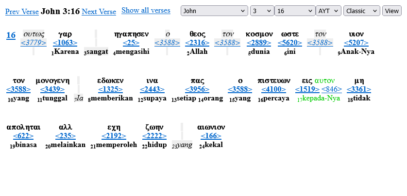
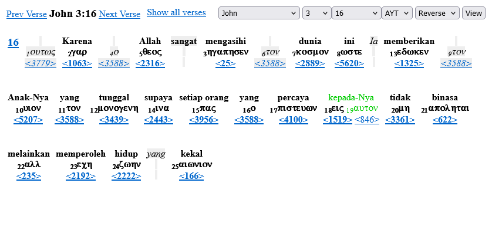
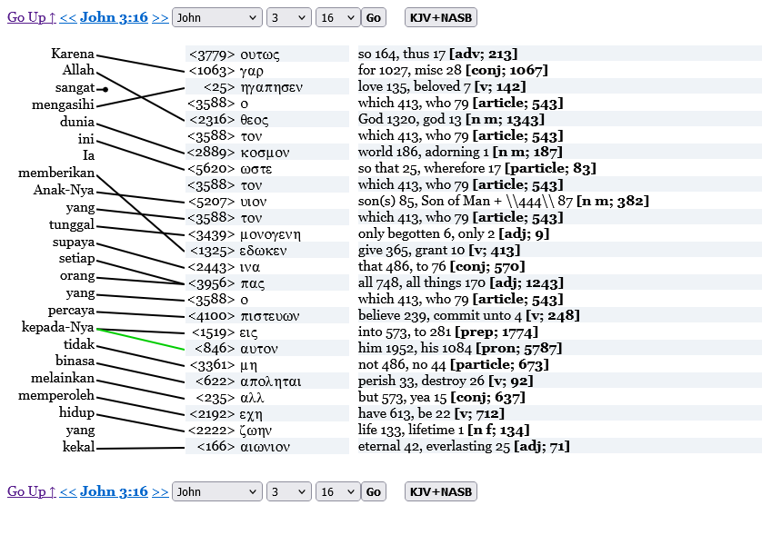

# AYT Interlinear

## Apa itu AYT?
Alkitab Yang Terbuka (AYT) adalah Alkitab berbahasa Indonesia yang dibuat dan diterbitkan oleh Yayasan Lembaga SABDA (YLSA) dengan dukungan para mitra untuk mempersembahkan sebuah versi Alkitab bahasa Indonesia yang tepat dan bertanggung jawab. AYT bukan Alkitab terjemahan baru, tetapi terjemahan ulang yang berdasar pada bahasa asli (Ibrani dan Yunani), Inggris, Indonesia, dan seluruh peralatan biblika modern.

## Definisi Interlinear
Baris-baris paralel yang unsur-unsur kalimatnya saling berkorelasi dan memberi suatu informasi, sebagai “alat studi kata” bahasa tertentu.

## Kegunaan Interlinear
Alkitab sebagai buku yang paling populer dan berpengaruh, paling banyak dicetak dan diterjemahkan dalam berbagai bahasa. (Namun) ada kemungkinan gap (kesenjangan) antar terjemahan, khususnya bahasa asli alkitab dan bahasa terjemahan.
Interlinear sebagai sarana untuk melihat makna kata atau frasa pada teks asli.

## Jenis-jenis Interlinear
a. Classic Interlinear
    
b. Reverse Interlinear
    
c. Bi-linear
    

## Datasets
Kami menyediakan data dalam format SQL, semua file berada dalam directory [data](./data). 
Berikut ini adalah informasi tentang file-file tersebut:
```
* bib_id_ayt_texts.sql      : Teks AYT Kejadian-Wahyu
* bib_id_aytst_texts.sql    : Teks AYT dengan nomor strong (embedded) Kejadian-Wahyu
* bib_id_ayt_pl_words.sql   : Teks AYT Perjanjian Lama per kata
* hebrew.sql                : Daftar kata dalam Ibrani
* bhsstr_word.sql           : Teks Alkitab Biblia Hebraica Stuttgartensia (BHS) with Strong PL Ibrani Per Kata
* itl_linkage_heb2ayt.sql   : Table korelasi Hebrew/Ibrani-AYT
* bib_id_ayt_pb_words.sql   : Teks AYT Perjanjian Baru per kata
* greek.sql                 : Daftar kata dalam Yunani
* wh_word.sql               : Teks Alkitab Westcott-Hort PB Yunani per kata
* itl_linkage_grk2ayt.sql   : Table korelasi per kata Alkitab Greek/Yunani-AYT
* vrefs.sql                 : Table referensi ayat dari nomor 1-31102 ((Kejadian 1:1 s.d. Wahyu 22:21)
```

## Lisensi

AYT is Alkitab Yang Terbuka, PB (2010,..-2024) and PL (2014,...2024).

AYT - text is Copyrighted, YLSA-AYT 2011,2024© -- this is to preserve and protect the quality of the Text. Suggestions, Comments, Changes, Corrections are encouraged, and can be submitted to YLSA-AYT.

AYT - usage (non-commercial) is CopyLefted, 2011🄯 -- this is to allow free usage/distribution of the text

AYT - derivatives (form, format, media, tools, resources) is CC, YLSA-AYT 2011(cc) -- we encourage you to use the AYT in creative ways, and to share the results. Creative Commons(CC) type is Credit(BY), Non-Commercial(NC), Shareable(SA)

AYT - translation license is freely given, 2011-2024 -- information and/or reporting is appreciated, but not required.

AYT permissions are managed by YLSA.

AYT (and Alkitab Yang Terbuka) name are Trademarks associated with the AYT Bible, and AYT ecosystem/tools.

URL: 
AYT  : https://ayt.co
YLSA : https://ylsa.org

Email: ylsa@sabda.org


## Referensi
+ [Teks Alkitab AYT GitHub](https://github.com/sabdacode/ayt/)
+ Interlinear AYT Perjanjian Lama: 
  - [Indeks Kata](https://ayt.co/interlinear/heb2ayt/), 
  - [Classic Interlinear](https://ayt.co/interlinear/view/?book=1&chapter=1&version=ayt&dir=classic&show=all), 
  - [Reverse Interlinear](https://ayt.co/interlinear/view/?book=1&chapter=1&version=ayt&dir=reverse&show=all), 
  - [Bi-linear](https://ayt.co/interlinear/heb2ayt/detail.php?id=1)
+ Interlinear AYT Perjanjian Baru: 
  - [Indeks Kata](https://ayt.co/interlinear/grk2ayt/), 
  - [Classic Interlinear](https://ayt.co/interlinear/view/?book=40&chapter=1&version=ayt&dir=classic&show=all), 
  - [Reverse Interlinear](https://ayt.co/interlinear/view/?book=40&chapter=1&version=ayt&dir=reverse&show=all), 
  - [Bi-linear](https://ayt.co/interlinear/grk2ayt/detail.php?id=23146)
+ Contoh multilinear dalam situs Alkitab.SABDA.org: [Yoh 3:16](https://alkitab.sabda.org/verse.php?book=Yoh&chapter=3&verse=16#str)
+ [File PDF Bible Interlinear](./Bible_Interlinear.pdf)
+ Situs AYT: https://ayt.co, situs YLSA: https://ylsa.org
